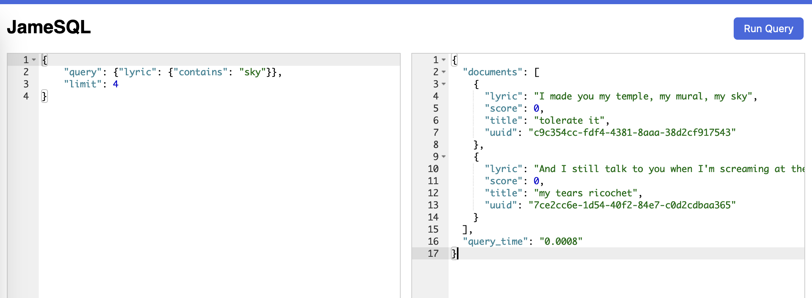

[](https://github.com/capjamesg/jamesql/actions/workflows/test.yml)

# JameSQL

A JameSQL database implemented in Python.

This project has support for:

- Inserting records
- Deleting records
- Searching for records that match a query
- Searching for records that match multiple query conditions

This database does not enforce a schema, so you can insert records with different fields.

Here is an example of a query run in the JameSQL web interface:



JamesQL is designed for use in single-threaded applications. It is not designed for use in multi-threaded applications.

## Installation

To install this project, run:

```
pip install jamesql
```

## Usage

### Create a database

To create a database, use the following code:

```python
from nosql import NoSQL

index = JameSQL()
```

### Add documents to a database

To add documents to a database, use the following code:

```python
index.add({"title": "tolerate it", "artist": "Taylor Swift"})
index.insert({"title": "betty", "artist": "Taylor Swift"})
```

When documents are added, a `uuid` key is added for use in uniquely identifying the document.

### Search for documents

A query has the following format:

```python
{
    "query": {},
    "limit": 2,
    "sort_by": "song",
    "skip": 1
}
```

- `query` is a dictionary that contains the fields to search for.
- `limit` is the maximum number of documents to return. (default 10)
- `sort_by` is the field to sort by. (default None)
- `skip` is the number of documents to skip. This is useful for implementing pagination. (default 0)

`limit`, `sort_by`, and `skip` are optional.

Within the `query` key you can query for documents that match one or more conditions.

An empty query returns no documents.

You can retrieve all documents by using a catch-all query, which uses the following syntax:

```python
{
    "query": "*",
    "limit": 2,
    "sort_by": "song",
    "skip": 1
}
```

This is useful if you want to page through documents. You should supply a `sort_by` field to ensure the order of documents is consistent.

#### Response

All valid queries return responses in the following form:

```json
{
    "documents": [
        {"uuid": "1", "title": "test", "artist": "..."},
        {"uuid": "2", "title": "test", "artist": "..."},
        ...
    ],
    "query_time": 0.0001,
    "total_results": 200
}
```

`documents` is a list of documents that match the query. `query_time` is the amount of time it took to execute the query. `total_results` is the total number of documents that match the query before applying any `limit`.

`total_results` is useful for implementing pagination.

If an error was encountered, the response will be in the following form:

```json
{
    "documents": [],
    "query_time": 0.0001,
    "error": "Invalid query"
}
```

The `error` key contains a message describing the exact error encountered.

### Document ranking

By default, documents are ranked in no order. If you provide a `sort_by` field, documents are sorted by that field.

For more advanced ranking, you can use the `boost` feature. This feature lets you boost the value of a field in a document to calculate a final score.

The default score for each field is `1`.

To use this feature, you must use `boost` on fields that have an index.

Here is an example of a query that uses the `boost` feature:

```python
{
    "query": {
        "or": {
            "post": {
                "contains": "taylor swift",
                "strict": False,
                "boost": 1
            },
            "title": {
                "contains": "desk",
                "strict": True,
                "boost": 25
            }
        }
    },
    "limit": 4,
    "sort_by": "_score",
}
```

This query would search for documents whose `post` field contains `taylor swift` or whose `title` field contains `desk`. The `title` field is boosted by 25, so documents that match the `title` field are ranked higher.

The score for each document before boosting is equal to the number of times the query condition is satisfied. For example, if a post contains `taylor swift` twice, the score for that document is `2`; if a title contains `desk` once, the score for that document is `1`.

Documents are then ranked in decreasing order of score.

#### Document ranking with script scores

The script score feature lets you write custom scripts to calculate the score for each document. This is useful if you want to calculate a score based on multiple fields, including numeric fields.

Script scores are applied after all documents are retrieved.

The script score feature supports the following mathematical operations:

- `+` (addition)
- `-` (subtraction)
- `*` (multiplication)
- `/` (division)
- `log` (logarithm)

You can apply a script score at the top level of your query:

```python
{
    "query": {
        "or": {
            "post": {
                "contains": "taylor swift",
                "strict": False,
                "boost": 1
            },
            "title": {
                "contains": "desk",
                "strict": True,
                "boost": 25
            }
        }
    },
    "limit": 4,
    "sort_by": "_score",
    "script_score": "((post + title) * 2)"
}
```

The above example will calculate the score of documents by adding the score of the `post` field and the `title` field, then multiplying the result by `2`.

A script score is made up of terms. A term is a field name or number (float or int), followed by an operator, followed by another term or number. Terms can be nested.

All terms must be enclosed within parentheses.

To compute a score that adds the `post` score to `title` and multiplies the result by `2`, use the following code:

```text
((post + title) * 2)
```

Invalid forms of this query include:

- `post + title * 2` (missing parentheses)
- `(post + title * 2)` (terms can only include one operator)

### Condition matching

There are three operators you can use for condition matching:

- `equals`
- `contains`
- `starts_with`

Here is an example of a query that searches for documents that have the `artist` field set to `Taylor Swift`:

```python
query = {
    "query": {
        "artist": {
            "equals": "Taylor Swift"
        }
    }
}
```

These operators can be used with three query types:

- `and`
- `or`
- `not`

### and

You can also search for documents that have the `artist` field set to `Taylor Swift` and the `title` field set to `tolerate it`:

```python
query = {
    "query": {
        "and": [
            {
                "artist": {
                    "equals": "Taylor Swift"
                }
            },
            {
                "title": {
                    "equals": "tolerate it"
                }
            }
        ]
    }
}
```

### or

You can nest conditions to create complex queries, like:

```python
query = {
    "query": {
        "or": {
            "and": [
                {"title": {"starts_with": "tolerate"}},
                {"title": {"contains": "it"}},
            ],
            "lyric": {"contains": "kiss"},
        }
    },
    "limit": 2,
    "sort_by": "title",
}
```

This will return a list of documents that match the query.

### not

You can search for documents that do not match a query by using the `not` operator. Here is an example of a query that searches for lyrics that contain `sky` but not `kiss`:

```python
query = {
    "query": {
        "and": {
            "or": [
                {"lyric": {"contains": "sky", "boost": 3}},
            ],
            "not": {"lyric": {"contains": "kiss"}},
        }
    },
    "limit": 10,
    "sort_by": "title",
}
```

### Running a search

To search for documents that match a query, use the following code:

```python
result = index.search(query)
```

### Strict matching

By default, a search query on a text field will find any document where the field contains any word in the query string. For example, a query for `tolerate it` on a `title` field will match any document whose `title` that contains `tolerate` or `it`. This is called a non-strict match.

Non-strict matches are the default because they are faster to compute than strict matches.

If you want to find documents where terms appear next to each other in a field, you can do so with a strict match. Here is an example of a strict match:

```python
query = {
    "query": {
        "title": {
            "contains": "tolerate it",
            "strict": True
        }
    }
}
```

This will return documents whose title contains `tolerate it` as a single phrase.

### Fuzzy matching

By default, search queries look for the exact string provided. This means that if a query contains a typo (i.e. searching for `tolerate ip` instead of `tolerate it`), no documents will be returned.

JameSQL implements a limited form of fuzzy matching. This means that if a query contains a typo, JameSQL will still return documents that match the query.

The fuzzy matching feature matches documents that contain one typo. If a document contains more than one typo, it will not be returned. A typo is an incorrectly typed character. JameSQL does not support fuzzy matching that accounts for missing or additional characters (i.e. `tolerate itt` will not match `tolerate it`).

You can enable fuzzy matching by setting the `fuzzy` key to `True` in the query. Here is an example of a query that uses fuzzy matching:

```python
query = {
    "query": {
        "title": {
            "contains": "tolerate ip",
            "fuzzy": True
        }
    }
}
```

### Wildcard matching

You can match documents using a single wildcard character. This character is represented by an asterisk `*`.

```python
query = {
    "query": {
        "title": {
            "contains": "tolerat* it",
            "fuzzy": True
        }
    }
}
```

This query will look for all words that match the pattern `tolerat* it`, where the `*` character can be any single character.

### Look for terms close to each other

You can find terms that appear close to each other with a `close_to` query. Here is an example of a query that looks for documents where `made` and `temple` appear within `7` words of each other and `my` appears within `7` words of `temple`:

```python
query = {
    "query": {
        "close_to": [
            {"lyric": "made"},
            {"lyric": "temple,"},
            {"lyric": "my"},
        ],
        "distance": 7
    },
    "limit": 10
}
```

### Update documents

You need a document UUID to update a document. You can retrieve a UUID by searching for a document.

Here is an example showing how to update a document:

```python
response = index.search(
    {
        "query": {"title": {"equals": "tolerate it"}},
        "limit": 10,
        "sort_by": "title",
    }
)

uuid = response["documents"][0]["uuid"]

index.update(uuid, {"title": "tolerate it (folklore)", "artist": "Taylor Swift"})
```

`update` is an override operation. This means you must provide the full document that you want to save, instead of only the fields you want to update.

### Delete documents

You need a document UUID to delete a document. You can retrieve a UUID by searching for a document.

Here is an example showing how to delete a document:

```python
response = index.search(
    {
        "query": {"title": {"equals": "tolerate it"}},
        "limit": 10,
        "sort_by": "title",
    }
)

uuid = response["documents"][0]["uuid"]

index.remove(uuid)
```

You can validate the document has been deleted using this code:

```python
response = index.search(
    {
        "query": {"title": {"equals": "tolerate it"}},
        "limit": 10,
        "sort_by": "title",
    }
)

assert len(response["documents"]) == 0
```

## String queries

JameSQL supports string queries. String queries are single strings that use special syntax to assert the meaning of parts of a string.

For example, you could use the following query to find documents where the `title` field contains `tolerate it` and any field contains `mural`:

```
title:"tolerate it" mural
```

The following operators are supported:

- `-term`: Search for documents that do not contain `term`.
- `term`: Search for documents that contain `term`.
- `term1 term2`: Search for documents that contain `term1` and `term2`.
- `'term1 term2'`: Search for the literal phrase `term1 term2` in documents.
- `field:'term'`: Search for documents where the `field` field contains `term` (i.e. `title:"tolerate it"`).

This feature turns a string query into a JameSQL query, which is then executed and the results returned.

To run a string query, use the following code:

```python
results = index.string_query_search("title:'tolerate it' mural")
```

_Note: Single quotes (') must be used to denote literal terms. Quotation marks (") do not yet work._

## Web Interface

JameSQL comes with a limited web interface designed for use in testing queries.

_Note: You should not use the web interface if you are extending the query engine. Full error messages are only available in the console when you run the query engine._

To start the web interface, run:

```
python3 web.py
```

The web interface will run on `localhost:5000`.

## Testing

You can run the project unit tests with the following command:

```
pytest tests/*.py
```

The tests have three modes:

1. Run all unit tests.
2. Run all unit tests with an index of 30,000 small documents and ensure the query engine is fast.
3. Run all unit tests with an index of 30,000 documents with a few dozen words and ensure the query engine is fast.

To run the 30,000 small documents benchmark tests, run:

```
pytest tests/*.py --benchmark
```

To run the 30,000 documents with a few dozen words benchmark tests, run:

```
pytest tests/*.py --long-benchmark
```

In development, the goal should be making the query engine as fast as possible. The performance tests are designed to monitor for performance regressions, not set a ceiling for acceptable performance.

## Development notes

The following are notes that describe limitations of which I am aware, and may fix in the future:

- `boost` does not work with and/or queries.
- The query engine relies on `uuid`s to uniquely identify items. But these are treated as the partition key, which is not appropriate. Two documents should be able to have the same partition key, as long as they have their own `uuid`.

## License

This project is licensed under an [MIT license](LICENSE).
